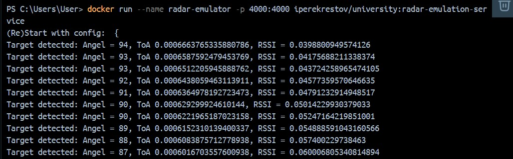
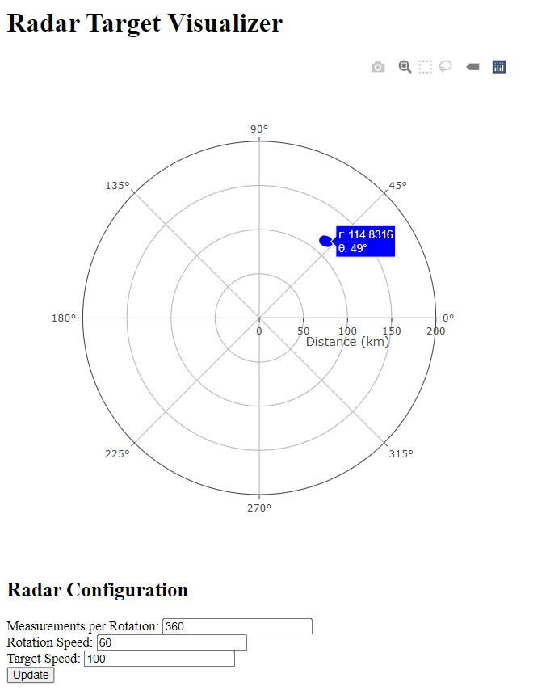
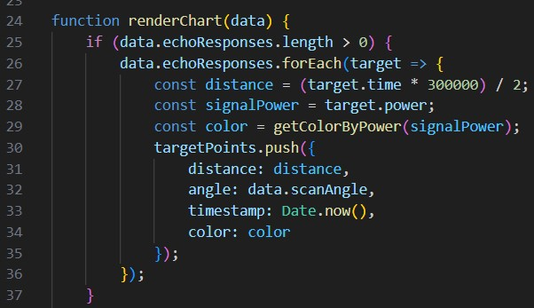
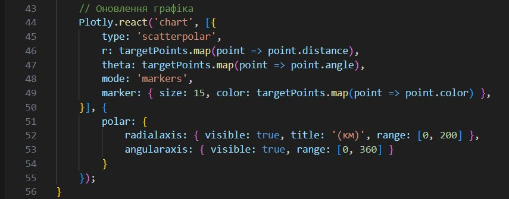
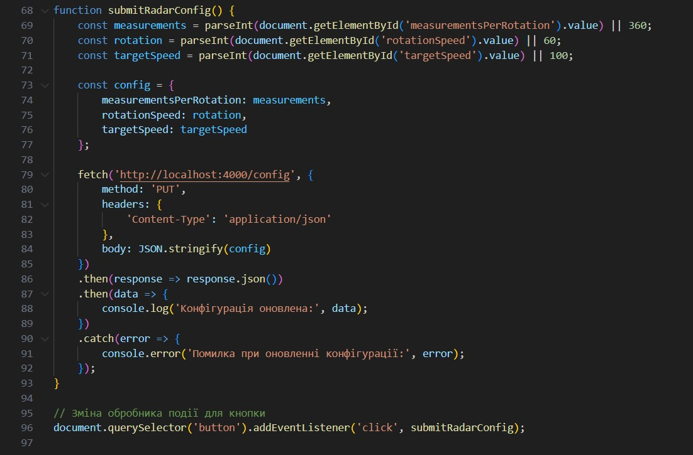

Завантажуємро та запускаємо емулятор вимірювальної частини радару  
завантажуємо  Docker image з Docker Hub: 
docker pull iperekrestov/university:radar-emulation-service 
запускаємо Docker контейнер 
  
Програма отримує дані про виявлені об'єкти з веб-сервера в реальному часі і показує їх на спеціальній діаграмі. 
створюємо додаток для відображення цілей:  
  
Кожна ціль представлена як точка на графіку з координатами (кут, відстань). 
  
Ця функція обробляє дані, отримані через WebSocket, і відповідає за оновлення графіка. 
У ній перебираються echoResponses, щоб обчислити відстань і кут для кожної цілі, які зберігаються в масиві targetPoints. 
  
Цей виклик в renderChart оновлює графік, використовуючи бібліотеку Plotly. 
Для кожної цілі передається радіус (відстань) і кут (кут) у полярних координатах, завдяки чому цілі відображаються на графіку. 
  
Можливість зміни параметрів вимірювальної частини радара за допомогою API запитів.  
  
submitRadarConfig(): 
Ця функція відповідає за збір даних з форми та відправку їх на сервер для оновлення конфігурації радара. 
Вона зчитує значення з полів форми (кількість вимірювань на оберт, швидкість обертання та швидкість цілей), формує об'єкт конфігурації і відправляє його за допомогою HTTP-запиту PUT. 
 
Обробка події для кнопки: 
Використовується addEventListener для прив'язки функції submitRadarConfig() до кнопки оновлення, що забезпечує можливість зміни параметрів, коли користувач натискає кнопку.